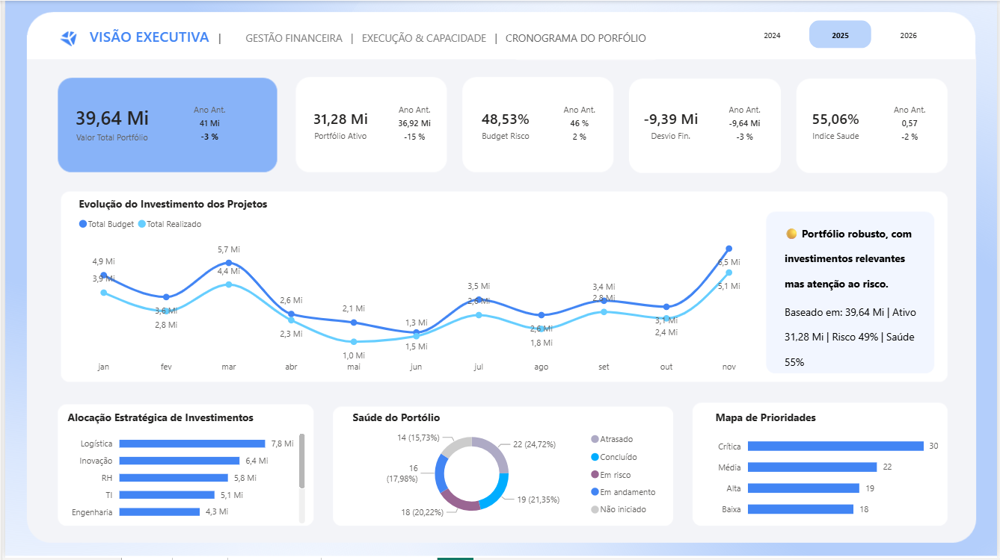
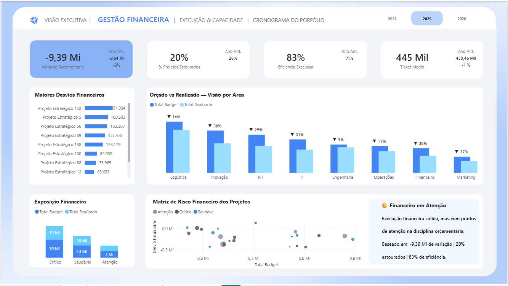
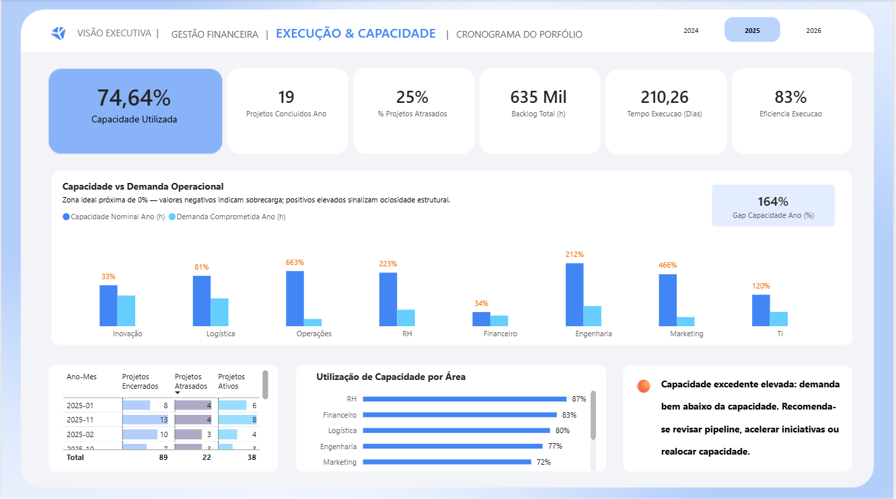
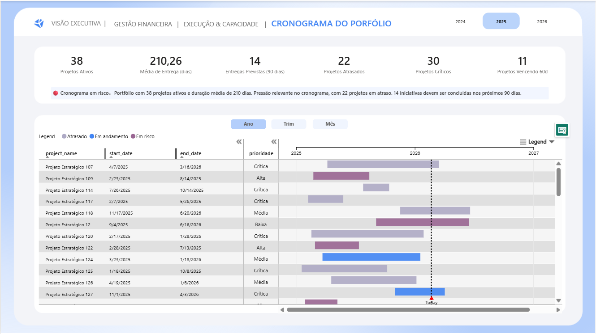

📊 Case de Portfólio
Dashboard Executivo de Portfólio de Projetos

🧩 Contexto do Problema

Empresas que trabalham com múltiplos projetos simultaneamente enfrentam desafios como:

Falta de visibilidade consolidada do portfólio

Dificuldade em identificar desvios financeiros

Problemas de priorização

Atrasos recorrentes sem visão preditiva

Baixa clareza sobre capacidade operacional

A ausência de uma visão integrada compromete a tomada de decisão estratégica.

🎯 Objetivo do Projeto

Desenvolver um Dashboard Executivo em Power BI capaz de:

Consolidar informações financeiras, operacionais e de cronograma

Monitorar a saúde do portfólio de projetos

Identificar riscos e desvios

Apoiar decisões estratégicas baseadas em dados

🛠️ Abordagem Técnica
1️⃣ Modelagem de Dados

Estruturação de modelo relacional

Criação de tabelas fato (Projetos, Financeiro, Cronograma)

Tabelas dimensão (Tempo, Área, Status, Responsáveis)

Relacionamentos otimizados para performance

2️⃣ Construção de Métricas (DAX)

Exemplos de indicadores desenvolvidos:

% de projetos no prazo

Variação orçamentária (Planejado vs Realizado)

Índice de atraso

Custo médio por projeto

Capacidade utilizada por área

Uso de:

Medidas calculadas

Variáveis em DAX

Inteligência temporal

Indicadores comparativos

3️⃣ Camadas de Análise
📈 Visão Executiva

KPIs estratégicos do portfólio

Status consolidado dos projetos

Indicadores visuais de risco

💰 Análise Financeira

Orçamento aprovado vs executado

Desvios financeiros

Análise por área e projeto

Eficiência de investimento

⚙️ Execução Operacional

Distribuição de projetos por área

Capacidade produtiva

Análise de sobrecarga

Gargalos operacionais

📅 Cronograma

Linha do tempo dos projetos

Projetos em atraso

Tendência de cumprimento de prazos

Análise de marcos (milestones)

📊 Principais Insights Gerados

Identificação de áreas com sobrecarga operacional

Projetos com risco financeiro elevado

Concentração de atrasos em determinados períodos

Desbalanceamento na alocação de recursos

## Preview

### Visão Executiva

### Gestão Financeira

### Execução e Capacidade

### Cronograma

